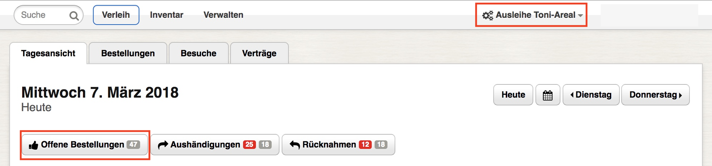
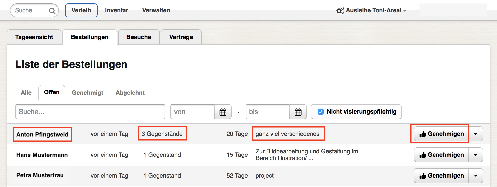
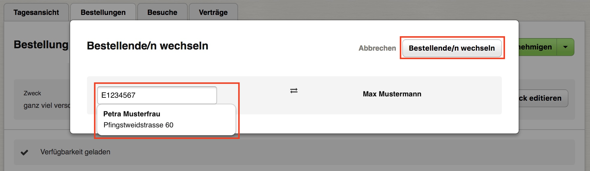

# Genehmigen und Herausgeben

Diese Seite betrifft nur Personen, die über die nötigen Berechtigungen verfügen: Inventar- oder Ausleihe-Verwalter.

- [Bestellung genehmigen](#bestellung-genehmigen)
- [Bestellung bearbeiten](#bestellung-bearbeiten)
  - [Bestellende/n wechseln](#bestellenden-wechseln)
  - [Bestellung genehmigen \(mit Kommentar\)](#bestellung-genehmigen-mit-kommentar)
  - [Modell tauschen](#modell-tauschen)
  - [Zweck editieren](#zweck-editieren)
  - [Auswahl löschen](#auswahl-editieren)
  - [Ausleihfrist anpassen](#ausleihfrist-anpassen)
  - [Gegenstand hinzufügen](#gegenstand-hinzufügen)
- [Bestellung ablehnen](#bestellung-ablehnen)

#### Bestellung genehmigen

Wählen Sie als erstes in der Navigationsleiste den gewünschten **Gerätepark** aus. Klicken Sie danach auf "Offene Bestellungen".Details zum Kunden oder den bestellten Gegenständen sowie längere Begründungen werden in einem Pop Up angezeigt, wenn Sie den Mauszeiger über den entsprechenden Text bewegen. **Bestätigen** Sie akzeptable Bestellungen mit "Genehmigen".

#### Bestellung bearbeiten

Navigieren Sie zu [Offene Bestellungen](#bestellung-genehmigen). Bewegen Sie nun den Mauszeiger auf das Dreiecksymbol rechts von "Genehmigen" und wählen "Editieren" aus.

Folgende **Funktionen** stehen zur Verfügung:

- [Bestellende/n wechseln](#bestellenden-wechseln)
- [Bestellung genehmigen \(mit Kommentar\)](#bestellung-genehmigen-mit-kommentar)
- [Zweck editieren](#zweck-editieren)
- [Ausleihfrist anpassen](#ausleihfrist-anpassen)
- [Gegenstand hinzufügen](#gegenstand-hinzufügen)
- [Auswahl löschen](#auswahl-editieren)
- [Modell tauschen](#modell-tauschen)

##### Bestellende/n wechseln

Klicken Sie auf "Bestellende/n wechseln" und suchen dann den Kunden, auf den die bestellten Gegenstände ausgeliehen werden sollen. Dies erfolgt am einfachsten mittels Barcode-Scanner und Legitimationsausweis. Alternativ können Sie nach einem Namen suchen. Wählen Sie den gewünschten Kunden in der Liste der Suchergebnisse aus, indem Sie auf dessen Name klicken und bestätigen dann mit "Bestellende/n wechseln".

##### Bestellung genehmigen \(mit Kommentar\)

Bewegen Sie den Mauszeiger auf das Dreiecksymbol rechts von "Bestellung genehmigen" und wählen "mit Kommentar" aus. Verfassen Sie Ihren Kommentar und bestätigen dann mit "Genehmigen".

##### Zweck editieren

Klicken Sie auf "Zweck editieren" und passen die Begründung an.

##### Ausleihfrist anpassen

Setzen Sie den Haken der Gegenstände, deren Ausleihfrist angepasst werden soll. Klicken Sie dann auf "Auswahl editieren".

##### Gegenstand hinzufügen

Üblicherweise wird diese Funktion zur Ergänzung einer Bestellung mit **Optionen** verwendet. Geben Sie die Ausleihfrist ein und suchen das gewünschte Modell dann mithilfe des Suchfelds. Wählen Sie einen Listeneintrag in den Suchergebnissen aus.

##### Auswahl löschen

Setzen Sie den Haken der Gegenstände, die Sie löschen möchten. Bewegen Sie dann den Mauszeiger auf das Dreiecksymbol rechts von "Auswahl editieren" und wählen "Auswahl löschen" aus.

##### Modell tauschen

Bewegen Sie den Mauszeiger auf das Dreiecksymbol rechts von "Eintrag ändern" des Gegenstands, den Sie austauschen möchten. Wählen Sie "Modell tauschen" aus und suchen dann im Dialog mittels Kategorien nach dem gewünschten Modell. Grau beschriftete Modelle sind in der gewählten Ausleihfrist nicht verfügbar.

#### Bestellung ablehnen

Navigieren Sie zu "Offene Bestellungen" wie oben in [Bestellung genehmigen](#bestellung-genehmigen) erläutert. Bewegen Sie nun den Mauszeiger auf das Dreiecksymbol rechts von "Genehmigen" und wählen "Ablehnen" aus.
